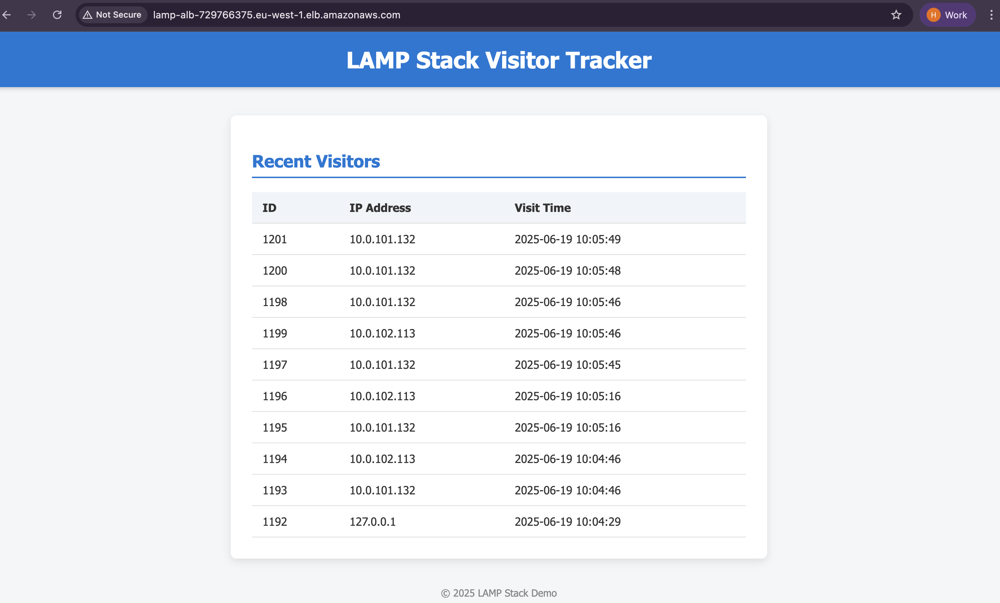

# LAMP Stack Visitor Tracker

This project is a simple yet powerful **LAMP stack (Linux, Apache, MySQL, PHP)** web application deployed using **Terraform**. It logs and displays the IP addresses of visitors, and is styled with clean HTML and CSS. The code is automatically pulled from an **S3 bucket** to the EC2 web server.

---

## Architecture


---

## LAMP Stack Visitor Tracker UI



---

## Live App

**http://lamp-alb-285155595.eu-west-1.elb.amazonaws.com/**

---

## Project Structure

### Terraform Folder Structure


### /var/www/html/ Folder Structure


### S3 Bucket Contents


---

## Features

- Logs visitor IPs in a MySQL/Aurora RDS database
- Displays last 10 visitors in a table
- Clean UI using external CSS
- Uses **Terraform** to provision:
  - EC2 instance with Apache, PHP
  - IAM Role for S3 access
  - Security Groups and Key Pairs
  - User Data to install LAMP and sync code from S3
- Application code (PHP/CSS) hosted in **Amazon S3**
- Uses environment variables for DB credentials

---

## Overview

- LAMP stack running on Amazon Linux EC2
- Application files deployed from S3 bucket
- Auto Scaling Group with Load Balancer
- Secure access via Security Groups
- Stores visitor IPs in MySQL database
- Modernized UI with HTML and external CSS
- Built and managed using **Terraform**

---

## Technologies Used

- **Amazon EC2**
- **Amazon S3**
- **Amazon RDS (MySQL)**
- **IAM**
- **Apache (httpd)**
- **PHP**
- **Terraform**

---

## How It Works

1. **Terraform** provisions:
   - An EC2 instance with user data that installs LAMP stack
   - Security Groups for SSH (22), HTTP (80)
   - IAM role for EC2 to pull files from S3
   - Environment variables injected into EC2 using user data
2. **User data script** on EC2:
   - Installs Apache, PHP, and MySQL client
   - Syncs app code from S3 bucket to `/var/www/html`
   - Configures permissions and restarts Apache

---

## Deployment Steps

### 1. Prerequisites

- AWS CLI configured
- Terraform installed
- S3 bucket with `index.php`, `config.php`, and `styles.css` uploaded

### 2. Prepare App Code

Upload your application files to S3:

```bash

aws s3 cp s3://lamp-stack-app-bucket-0921/php-app/ /var/www/html/ --recursive

```

### 3. Define Terraform Variables

```
# variables.tf
variable "region" {}
variable "key_name" {}
variable "db_endpoint" {}
variable "db_name" {}
variable "db_username" {}
variable "db_password" {}
variable "s3_bucket_name" {}

```

### 4. Run Terraform

```
terraform init
terraform plan
terraform apply -auto-approve

```

### 5. Access the App using Load balancer(ALB)

Once Terraform completes it will display:
```
alb_dns_name = "lamp-alb-285155595.eu-west-1.elb.amazonaws.com"
db_endpoint = <sensitive>
db_secret_arn = <sensitive>

```
Visit `alb_dns_name` to access the app

---

## Infrastructure Overview

- **Amazon EC2**: Hosts Apache, PHP, and app logic
- **Amazon RDS (MySQL)**: Managed relational DB backend
- **Amazon S3**: Stores PHP, HTML, CSS files for deployment
- **Elastic Load Balancer (ALB)**: Distributes traffic
- **Auto Scaling Group (ASG)**: Automatically scales EC2 instances
- **Terraform**: Automates provisioning and configuration

---

## Infrastructure Settings

The infrastructure is fully defined and managed using **Terraform**, allowing easy customization and scalability. Below are key variables and their roles:

| Variable          | Description                                                                 | Default       |
|-------------------|-----------------------------------------------------------------------------|---------------|
| `region`          | AWS region to deploy the infrastructure                                     | `us-east-1`   |
| `instance_type`   | EC2 instance type used for the web servers                                  | `t3.medium`   |
| `key_name`        | Name of the existing AWS EC2 Key Pair for SSH access                        | *(required)*  |
| `db_name`         | MySQL database name to be created and used by the PHP application           | `lampdb`      |
| `db_username`     | Username for MySQL database access                                          | `admin`       |
| `db_password`     | Password for MySQL database access                                          | *(required)*  |
| `db_endpoint`     | RDS/Aurora endpoint that the EC2 instance connects to                       | *(required)*  |
| `s3_bucket_name`  | Name of the S3 bucket where PHP/CSS app code is stored                      | *(required)*  |
| `min_size`        | Minimum number of EC2 instances in the Auto Scaling Group (if enabled)      | `2`           |
| `max_size`        | Maximum number of EC2 instances in the Auto Scaling Group (if enabled)      | `3`           |
| `vpc_id`          | ID of the VPC where resources will be provisioned                           | *(required)*  |
| `subnet_ids`      | List of public subnets for EC2 instances                                    | *(required)*  |
| `iam_role_name`   | Name of the IAM Role for EC2 instance S3 access                             | `lamp-s3-role`|

> 💡 You can override these variables in a `terraform.tfvars` file or by passing them via the CLI when applying Terraform.

---

## Adherence to AWS Well-Architected Framework

This LAMP stack application architecture aligns with key pillars of the [AWS Well-Architected Framework](https://docs.aws.amazon.com/wellarchitected/latest/framework/welcome.html), particularly in terms of **Scalability**, **Availability**, and **Operational Excellence**.

### Scalability

The system is built to handle changing demand efficiently:

- **Auto Scaling Group (ASG):**
  - Automatically increases or decreases the number of EC2 instances based on CPU utilization or other metrics.
  - Ensures that application performance remains stable during traffic spikes or drops.
- **Decoupled Application Deployment:**
  - Application code is stored in an S3 bucket, enabling stateless and reproducible deployments across multiple instances.
- **Elastic Load Balancer (ALB):**
  - Distributes incoming traffic evenly across multiple instances, allowing horizontal scaling with minimal configuration.

### High Availability

High availability is achieved through a combination of design decisions:

- **Multi-AZ Deployment:**
  - Public subnets and EC2 instances are spread across multiple Availability Zones, ensuring that a failure in one zone does not bring down the application.
- **Elastic Load Balancer:**
  - Automatically detects and avoids unhealthy instances, maintaining seamless user experience.
- **Infrastructure as Code (Terraform):**
  - Ensures consistent, repeatable provisioning of infrastructure, aiding in rapid recovery and low downtime in case of failure.

### Security & Reliability

- **IAM Role with Least Privilege:** EC2 only accesses S3 as needed
- **User Data Bootstrap:** Ensures each instance is self-configuring
- **Repeatable Deployments:** Terraform ensures consistent, versioned infrastructure

### Operational Excellence (Optional but Good to Mention)

- **Environment Variables:**
  - Configuration is handled securely using environment variables injected during EC2 launch.
- **Terraform Modules:**
  - Version-controlled infrastructure code promotes collaboration, reuse, and faster incident resolution.
- **S3-backed Application Syncing:**
  - Using S3 as a centralized source of truth for app files ensures easy updates and rollback.

---

## Cleanup

To destroy all resources:

```
terraform destroy

```


